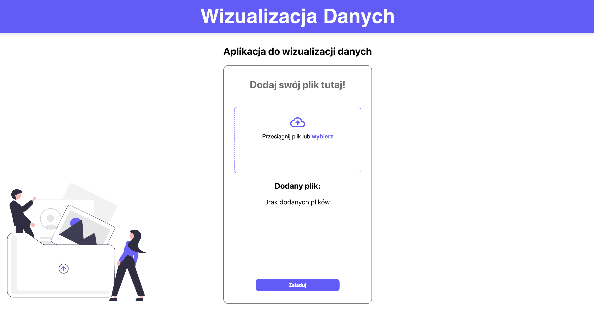
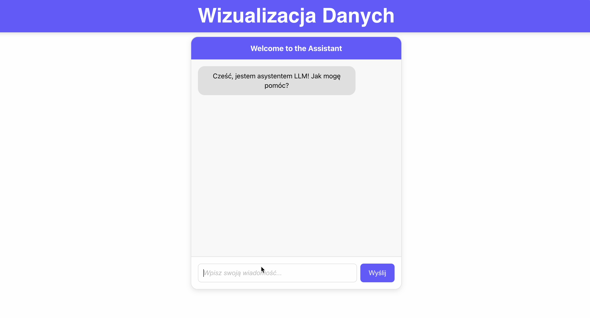
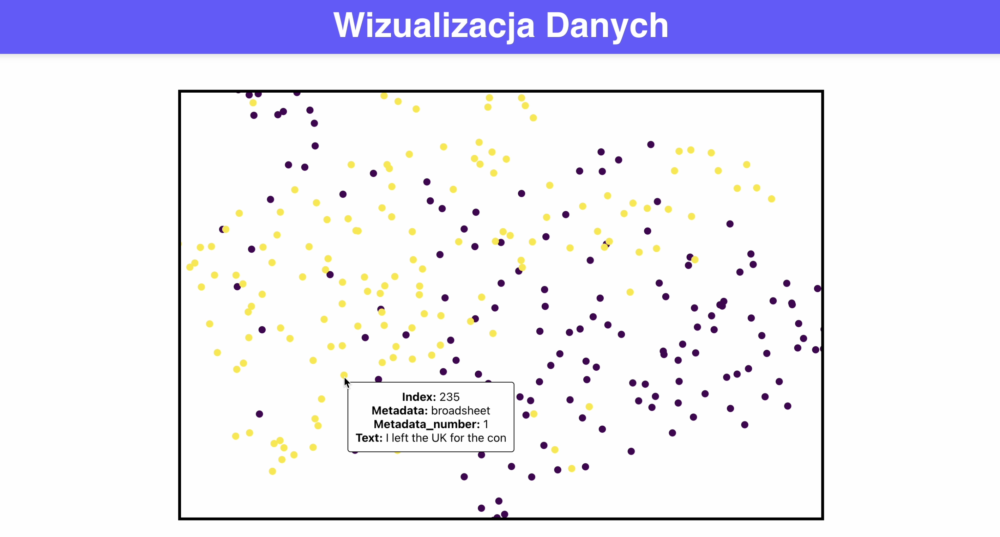

# Wizualizacja Wielkich Zbiorów Danych

## Opis projektu

Projekt miał na celu stworzenie interaktywnej aplikacji webowej do wizualizacji 2D tekstów o jednakowej długości, pobranych z pliku CSV, wykorzystując bibliotekę React oraz techniki redukcji wymiarowości.

Aplikacja pozwala użytkownikowi na łatwe wgranie własnego pliku CSV lub Excel (.csv, .xls, .xlsx) za pomocą modułu drag & drop lub klasycznego wyboru pliku:

Po przesłaniu pliku aplikacja pobiera dostępne kolumny danych i pozwala użytkownikowi skonfigurować parametry wizualizacji, korzystając z jednego z dwóch trybów komunikacji:

- **Czat hardcoded** — oparty na z góry ustalonej sekwencji pytań
- **Czat LLM** — wykorzystujący model językowy Llama 3.1 70B

Po zatwierdzeniu parametrów następuje analiza danych za pomocą algorytmu UMAP, który redukuje wymiarowość danych do przestrzeni 2D. Każdy punkt na wykresie reprezentuje pojedynczy rekord tekstowy wraz z odpowiednimi metadanymi. Wizualizacja jest interaktywna — po najechaniu kursorem na punkt wyświetlane są szczegółowe informacje, takie jak indeks rekordu, wartość tekstu i metadane:

---

## Technologie

- **Frontend:** React
- **Backend:** Python
- **Modele ML:**
  - `bge-m3` — model do wektoryzacji tekstów,
  - `llama 3.1 70B` — model LLM do komunikacji w trybie czatu.

---

## Skład zespołu

- Jakub Budziło 259069  
- Julia Gościniak 259164  
- Katarzyna Hajduk 259189

---
